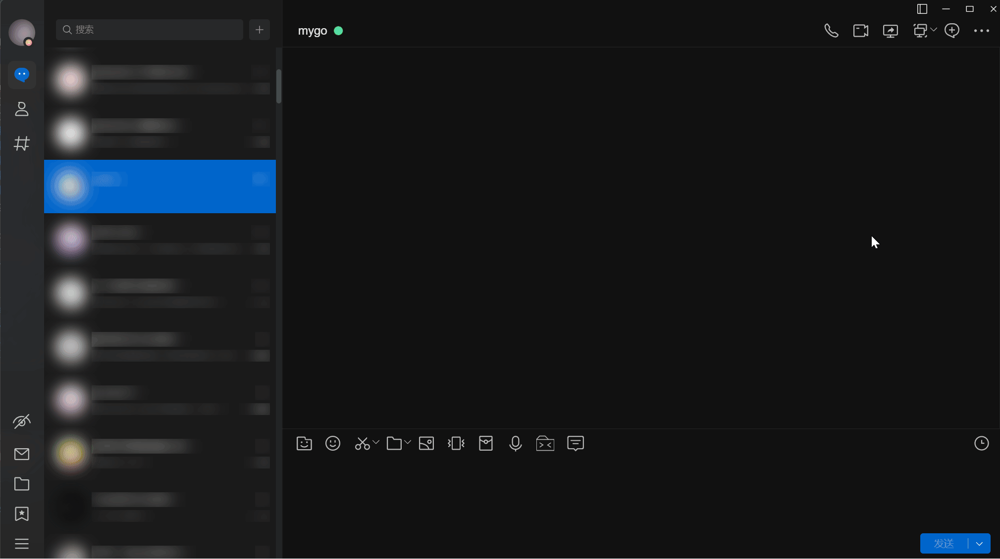

## LiteLoaderQQNT-NekoImageGallerySearch

[](https://wakatime.com/badge/github/pk5ls20/LiteLoaderQQNT-NekoImageGallerySearch)

Another web UI for [NekoImageGallery](https://github.com/hv0905/NekoImageGallery), but completed using Vue, and **seamlessly integrated with NTQQ** through [LiteLoaderQQNT](https://liteloaderqqnt.github.io)

[中文文档](README_ZH.md)

## Screenshots

-----




-----

## Installation

### Download the stable build of the plugin from [Releases](https://github.com/pk5ls20/LiteLoaderQQNT-NekoImageGallerySearch/releases) **(Recommended)**
1. Download the stable build `LiteLoaderQQNT-NekoImage.zip` from [Releases](https://github.com/pk5ls20/LiteLoaderQQNT-NekoImageGallerySearch/releases)
2. Extract the zip to the plugin path

### Download the latest build of the plugin from Artifacts in Action
1. Download the build `LiteLoaderQQNT-NekoImage.zip` from Artifacts in Action.
2. Extract the zip to the plugin path

### Build and install manually

#### Build manually
```shell
npm install -g yarn
yarn install && yarn plugin-build
```

#### install manually
```shell
cp -r LiteLoaderQQNT-NekoImage /path/to/your/LiteloaderQQNT/plugin-path
```

## Known issues & Development RoadMap

> See [RoadMap](https://github.com/users/pk5ls20/projects/5) for more known issues and development roadmap.

- The settings of this plugin need to restart QQ to take effect.

## Testing environment
This plugin was developed and tested in the following environment:
- Windows 11 + QQ >9.9.9-22920 + LiteLoaderQQNT 1.1.1


## Reference & Special Thanks

Thanks to the following projects. LiteLoaderQQNT-NekoImage could not have been realized without you!

- https://github.com/hv0905/NekoImageGallery.App
- https://github.com/xtaw/LiteLoaderQQNT-Fake-Message
- https://github.com/MUKAPP/LiteLoaderQQNT-DeepL
- https://github.com/xh321/LiteLoaderQQNT-QR-Decode
- https://github.com/xiyuesaves/LiteLoaderQQNT-lite_tools
- https://github.com/Night-stars-1/LiteLoaderQQNT-Plugin-LLAPI
- https://github.com/LLOneBot/LLOneBot
- https://github.com/darkreader/darkreader
